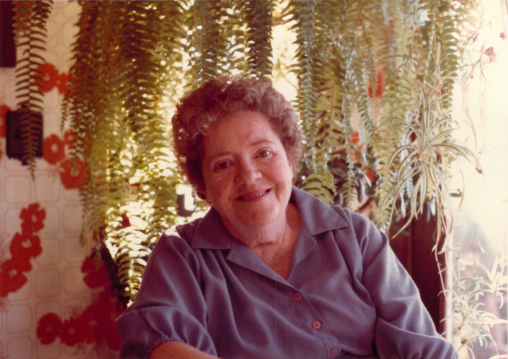
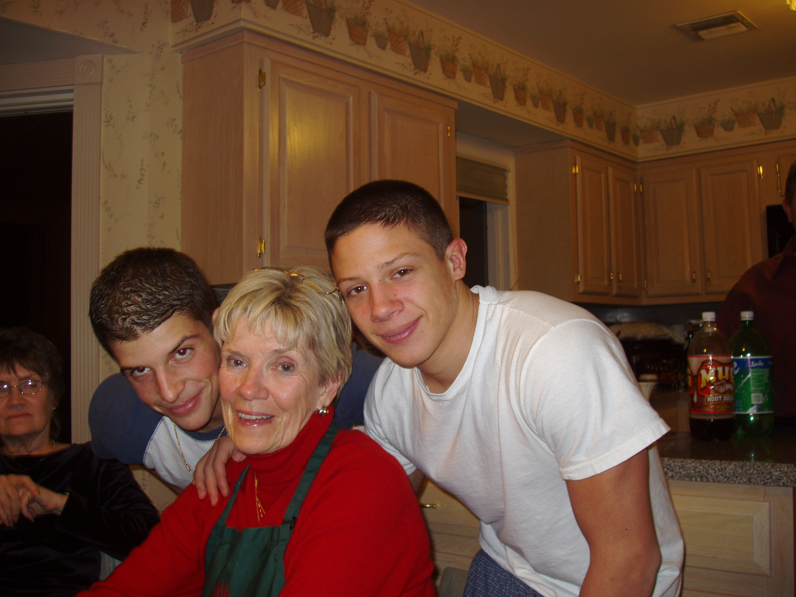
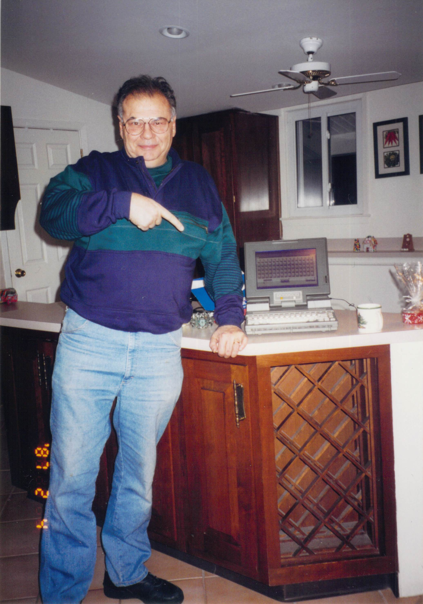
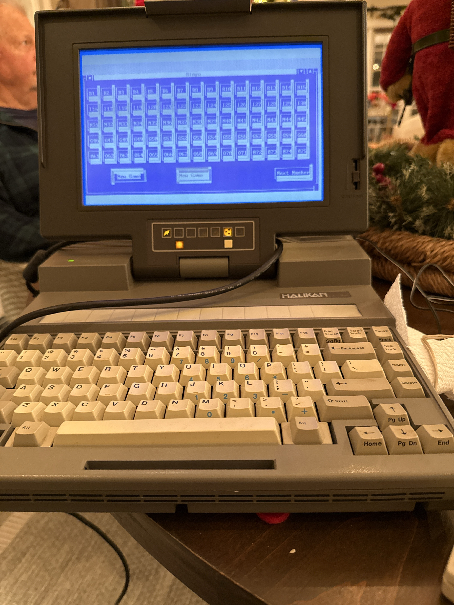
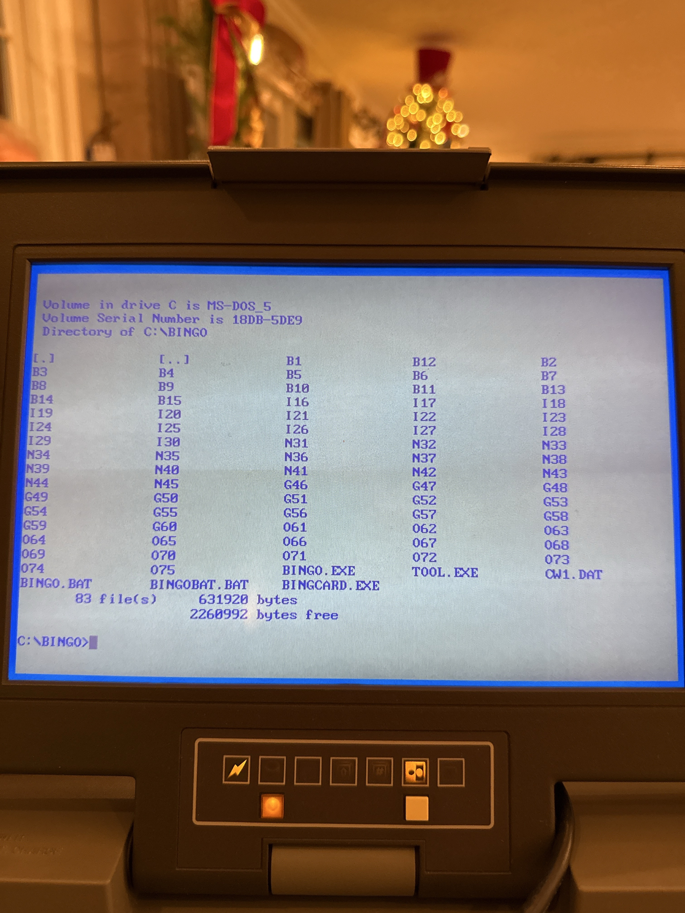

# 🎄 Pop's Bingo — A Family Story

> *A story of tradition and a voice that will always call the next number.*
>
> by Nick DeMarco

---

## ❄️ A Long Island Christmas

I grew up in Long Island, New York, raised by an Italian father and an Irish mother whose roots ran deep through my grandmother, **Nana**.

Like many families of that era and still today, heritage was everything during the holidays. Christmas Eve meant honoring tradition — the Italian way. We'd attempt the classic *Feast of the Seven Fishes*, though we adapted it to suit our tastes: **scungilli, calamari, shrimp**, and whatever else we loved. There was always chicken parmesan or lasagna for family members who didn't like fish. It was never about perfection. It was about being together.

**Nana** would come stay with us around the holidays. Sometimes she lived with us for stretches of time. **Auntie** too. The house would fill with voices — laughing, arguing, storytelling. We were an emotional family, Italian and Irish blood running hot. There were good times and hard times, but what I remember most is the warmth.

And every Christmas Eve, after the food was cleared and the table was set fresh, we played **Bingo**.

---

## ❄️ Nana Mae — Where It All Began

That Christmas Eve Bingo tradition? It all started with my **Nana** — my mother's mother. Years later, when the great-grandkids came along and my mom became "Nana" to them, we started calling her **Nana Mae** to tell them apart. But to me, she was always just Nana.



Nana was Irish and proud of it. She loved her heritage fiercely. But nothing — *nothing* — compared to how much she loved Bingo.

Nana didn't just enjoy Bingo. She *lived* for it. Bingo was joy, anticipation, community, and ritual all rolled into one. When my wife **Cathie** and I would visit her in Orlando, one of the highlights was taking her to a local bingo hall. Sitting beside her, watching her light up as the numbers were called, you could feel how something as simple as Bingo brought people together.

She also taught me how to argue. How to debate. How to hold my ground. I think of her often, and I miss her deeply. She passed around 1995, but her spirit lives on in every game we play.

Cathie likes Bingo too — but no one loved it like Nana. That love planted a seed.

---

## ❄️ Mom Marge — The Director Behind the Scenes

None of this would have happened without **Mom**.



My mother, **Marge**, was the director behind the scenes for decades. Every Christmas, she'd go out and buy a collection of small, thoughtful, fun prizes for the Bingo winners to choose from. She'd set the table, organize the games, gather the family together.

Pop built the technology. But Mom built the moment.

She was the unsung hero of every Christmas gathering. The one who turned chaos into tradition. The one who made sure everyone felt welcome, fed, and loved. Without her, the Bingo games — and so much else — would never have come together.

Now at 87, Mom isn't one to easily step aside — and honestly, why would she? This was her tradition to nurture, her family to gather. But as the years have passed, my sister-in-law **Eileen**, my sister **Peggy**, and my wife **Cathie** have gently stepped up alongside her, making sure the tradition continues even as the family grows and spreads.

---

## ❄️ The Tradition Spreads

As with all growing families, the holiday dynamic changes each year. Peggy's son **Kevin** now lives in upstate New York. My brother **Bud** and **Eileen's** family — **Nicky**, **Ashley**, and **Joey** — still live near home and have been the heart of keeping this tradition alive, gathering every Christmas Eve to carry on what Nana Mae started.

At Thanksgiving 2024, Kevin's family couldn't make it for Christmas Eve, so Mom, Dad, Cathie, and I drove up to his house in Glens Falls, NY with Peggy — and we played Bingo.

What started as one family around one table has become multiple families, multiple gatherings, multiple games — all connected by the same tradition Nana Mae started decades ago.

And the circle keeps growing. My nieces and nephews, their spouses and significant others — they're not just winning prizes now, they're buying them too. Everyone's part of the tradition. Everyone's part of the process.

---

## ❄️ Growing Up with Pop's Voice

My dad, **Nick DeMarco**, was a successful business owner who worked tirelessly to provide for his family. But he wasn't just a businessman — he was a problem-solver, a builder, and someone who loved learning new things.



In the mid-1980s, he decided to pursue a lifelong dream: **learning to fly**.

Through his friend **Frank**, who worked at Grumman, my dad joined a private pilot club called **GACE**. The club operated a small fleet of Cessna 152s and 172s. Like many clubs at the time, scheduling was painfully manual — you had to drive to the airport, check a paper schedule, and hope a plane was available.

My dad saw the problem. And he fixed it.

Using a piece of hardware called **Big Mouth** — a voice telephony board — along with MS-DOS and his own programming skills, he built a **telephone-based aircraft scheduling system**. Members could call in, listen to spoken prompts, and reserve an aircraft without ever leaving home. He called it the **QTS System**.

I grew up hearing him develop it. Over and over, I'd hear his voice echoing through the house:

*"Nine Sierra Foxtrot..."*
*"Four Lima Hotel..."*
*"Four Victor Bravo..."*

The military phonetic alphabet. Tail numbers. Scheduling prompts. Recorded again and again until they were perfect.

At the time, honestly? It was kind of annoying. Hearing the same phrases repeated endlessly while he got the recordings just right.

But now that he's gone, those memories are precious. That voice — patient, deliberate, unmistakably his — is something I'll never forget.

The QTS system was deployed at GACE, and members loved it. So much so that he went on to sell copies to other flying clubs. His work was even written up in a private pilots' magazine — a proud moment that reflected how far ahead of the curve he truly was. *This was interactive voice technology, built by hand, years before it was commonplace.*

The same voice that once called airplane tail numbers would later call Bingo numbers.

---

## ❄️ From Airplanes to Bingo

Every Christmas, the family gathered. Mom bought the Bingo prizes. The table was set. And then came the question:

**Why not build a Bingo caller?**



*The "Luggable" IBM-PC compatible that has run Pop's Bingo for over three decades. Built-in CRT, mechanical keyboard, and an ISA sound card that brought Pop's voice to life.*

If Pop could build a telephone scheduling system using his own recorded voice, he could certainly create a Bingo caller.

So he did.

Using the same core ideas behind QTS, my dad built a **Bingo calling application**. He recorded his own voice calling *every single Bingo number*. Each call was stored individually, mapped perfectly, and played back by the computer.

When Bingo started, it wasn't a generic voice. It was **Pop**. Calling every number.

---

## ❄️ A Voice That Never Got Old

The grandkids loved it.

They couldn't get enough of hearing Pop's voice calling the numbers. That voice — warm, familiar, distinctly his — filled the room every Christmas. It brought smiles, laughter, and a deep sense of connection.

Bingo became more than a game. It became a way for the family to come together. A way to remember. A way for Pop to still be there with us.

Then came **Christmas 2025** — the first without my dad. He passed away earlier that year.

My brother hosted Christmas Eve. He had the old Luggable — the 400-pound computer my dad developed QTS and the Bingo game on. After some coaxing, we got it to boot. And we played Bingo.

It was a great session. Everyone was laughing, having a wonderful time, hearing Pop's voice call out the numbers — like he was right there with us.

But in the back of my mind, I couldn't shake the thought: **this machine isn't going to last much longer.**

And if we don't do something, we're going to lose this forever. We're going to lose my dad's voice forever.

That's where I got the idea for this app.

---

## ❄️ Saving Pop's Voice

After Christmas, I brought the Luggable home with me. I had to try to save Pop's voice.

The machine wouldn't boot. I pressed the power switch dozens of times. Nothing. The last time that old PC had come to life was **December 24th** — Christmas Eve — the first Christmas without my dad. And now it was silent.

So I did what my dad would have done. I took it apart.

I pulled out the hard drive — a tiny 40 MB drive from the 1980s. It wouldn't mount on any modern computer. It was dead.

Through a friend who works in data storage, I connected with a professional data recovery company. A few days later: **"Good news! We are able to recover your data!"**

They salvaged everything. All 75 of Pop's voice recordings. The Bingo program. The QTS system. Everything my dad built, preserved.

But recovering the files was only half the battle. The audio was raw binary data from the 1980s — no headers, no documentation, created for hardware that predated modern audio standards. With the help of AI tools, I built a decoder to experiment with different parameters. For the first hour, all I heard was static.

Then, through the noise, I heard something familiar. Faint, buried under hiss and distortion, but unmistakable:

> *"B... seven..."*

My heart stopped. That was him. That was my dad's voice.

After more experimentation, everything clicked. The static melted away. And there it was — **Pop's voice**, clear as the day he recorded it in the 1980s.

*"B-7... I-22... N-31..."*

Forty years of technology changes. A dead hard drive. A proprietary format. And my dad's voice, brought back to life.

**Pop's voice is safe now.** It lives in this app. It lives in the cloud. It will play on Christmas Eve for as long as our family gathers to play Bingo.

---

## ❄️ Photo Gallery

### The Original System



*The `C:\BINGO` directory listing from the original machine. 83 files totaling just 632KB — including BINGO.EXE, BINGOCARD.EXE, and all 75 of Pop's voice recordings.*

---

## ❄️ Why This Project Exists

I learned a lot from my dad. I'm a lot like him.

When I see a problem, I want to fix it. That's what he did. That's what he taught me — not with words, but by example. He saw a problem with airplane scheduling, and he built QTS. He saw a way to make Christmas Bingo better, and he created this tradition.

When that old Luggable struggled to power up on Christmas 2025, I saw a problem too. This machine isn't going to last forever. And if it dies, we lose his voice. We lose this piece of him.

But I could do something about it. So I did.

This app exists to be a **vessel** — to hold my dad's voice and my dad's memory. A small part of his legacy. And in a way, building it is how I honor him. By carrying forward what he started.

And on Christmas Eve, that voice will still be there. Calling the numbers. For as long as we're playing Bingo. For as long as we're using this app. For as long as we gather as a family.

**Pop's Bingo** is a love letter to family, to tradition, and to the voice that will always call the next number.

**Thanks, Dad.**

---

*With love — for Nana, for Mom, for Dad, and for all the generations who gather around the table every Christmas.* 🎄

---

## Quick Start

No installation required. Just open in a browser:

```bash
# Clone the repository
git clone https://github.com/nickdnj/PopsBingo.git
cd PopsBingo

# Start a local server (for audio to work properly)
python3 -m http.server 8000

# Open in your browser
open http://localhost:8000
```

Or simply open `index.html` directly in any modern browser.

### Controls
- **Call Number** (or press `Space`) — Call the next random number
- **New Game** — Reset and start fresh
- Voice files auto-load from the `audio/` folder

### Easter Egg 🎄
Click on the **Pop's Christmas Bingo** logo to read the full family story.

---

## Using Pop's Voice Files

The app automatically loads voice files from the `audio/` folder on startup.

### Current Setup
The repository includes Pop's original voice files, restored from the 1980s hard drive.

### Voice File Format
- WAV format, named: `B1.wav`, `B2.wav`, ... `O75.wav`
- Original files were 8-bit unsigned PCM, mono, 11.025 kHz
- Converted using delta-decoding to reconstruct the original waveform

---

## Technical Details

### Bingo Rules (75-Ball)
| Letter | Numbers |
|--------|---------|
| B | 1–15 |
| I | 16–30 |
| N | 31–45 |
| G | 46–60 |
| O | 61–75 |

### Original Audio Format
Pop's files were:
- Raw PCM with delta encoding
- 8-bit unsigned, mono, 11.025 kHz sample rate
- No headers (created for Big Mouth ISA sound card)

The files required delta-decoding with an accumulator to reconstruct the original waveform.

---

## Technical Deep Dive (For the Curious)

### Data Recovery Journey

The full technical story of recovering Pop's voice:

1. **Hard Drive Extraction**: Pulled a 40 MB 3.5-inch IDE drive from the 1980s Luggable
2. **Professional Recovery**: SalvageData in Cleveland recovered all files from the dead drive
3. **File Analysis**: 75 files with no extensions, no headers — raw binary data
4. **Audio Reverse-Engineering**: Built multiple iterations of an audio tuner app
5. **The Breakthrough**: Discovered the Big Mouth card used delta encoding
6. **Accumulator Logic**: Each byte was a *change* from the previous value, requiring accumulation
7. **Final Conversion**: With the right "leak" factor, Pop's voice emerged crystal clear

### The Audio Tuner Iterations

We went through seven versions of the audio tuner, experimenting with:
- Sample rates (8000 Hz to 22050 Hz)
- Bit depths (8-bit vs 16-bit)
- Signed vs unsigned PCM
- Mono vs stereo interpretation
- Delta encoding with various accumulator configurations

The key insight came from understanding the Big Mouth ISA card's proprietary format — it used delta encoding where each byte represented the *change* from the previous sample, not the absolute value.

### SoX Conversion (Reference)

For converting raw PCM files with known parameters:
```bash
sox -r 11025 -c 1 -b 8 -e unsigned-integer B12 B12.wav
```

---

*Built with love, preserved forever.* 🎄
